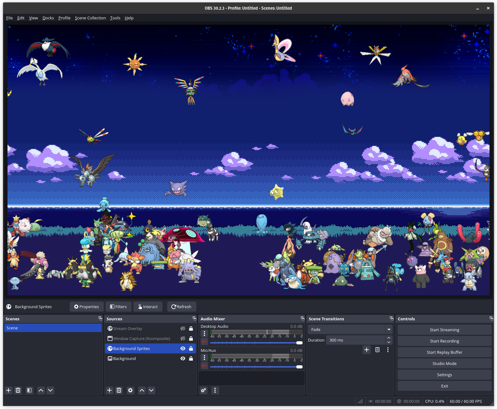
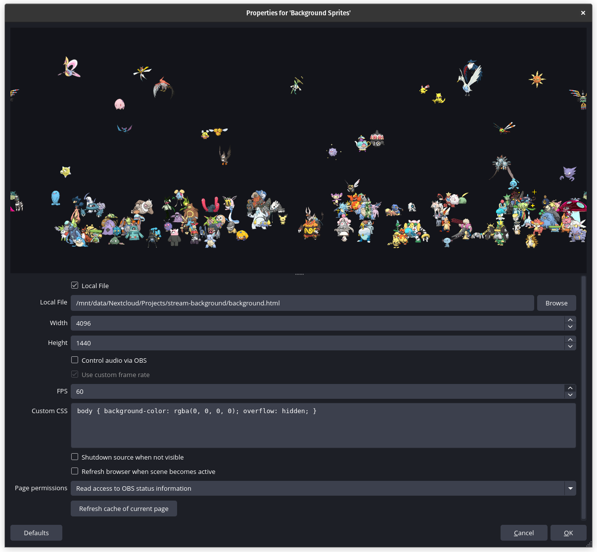
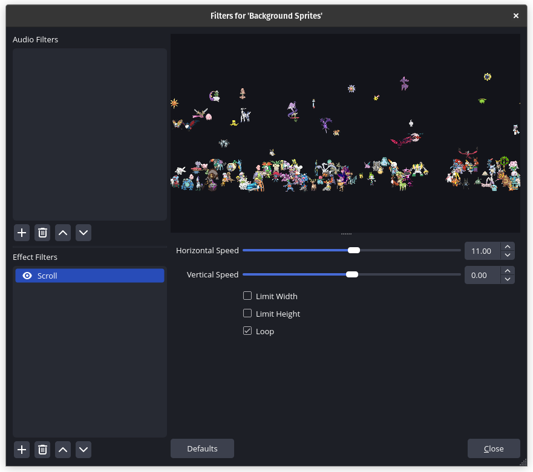

# Stream Background

This is the background behind my [🔴24/7✨Shiny✨Hunting Bot Stream](https://www.youtube.com/watch?v=W6OOnrx8g58).

Full credit for all sprites included: [Pokémon Showdown](https://pokemonshowdown.com/).
- Normal 3D sprites: https://play.pokemonshowdown.com/sprites/ani/?C=M;O=D
- Shiny 3D sprites: https://play.pokemonshowdown.com/sprites/ani-shiny/?C=M;O=D

## Notes
- Controllable parameters such as shiny odds, max onscreen Pokémon, refresh rate etc. are at the top of [background.js](scripts/background.js).
- Contains hard coded values that are designed to work for `2560*1440` stream resolution.

## OBS Config

- Add Image source: `background.png`.
- Add Browser source (local file): `background.html`.
    - Width: `4096`.
    - Height: `1440`.
    - Custom CSS: `body { background-color: rgba(0, 0, 0, 0); overflow: hidden; }`
- Add `Scroll` effect filters to the image and browser sources.
    - Horizontal Speed: `11`.

