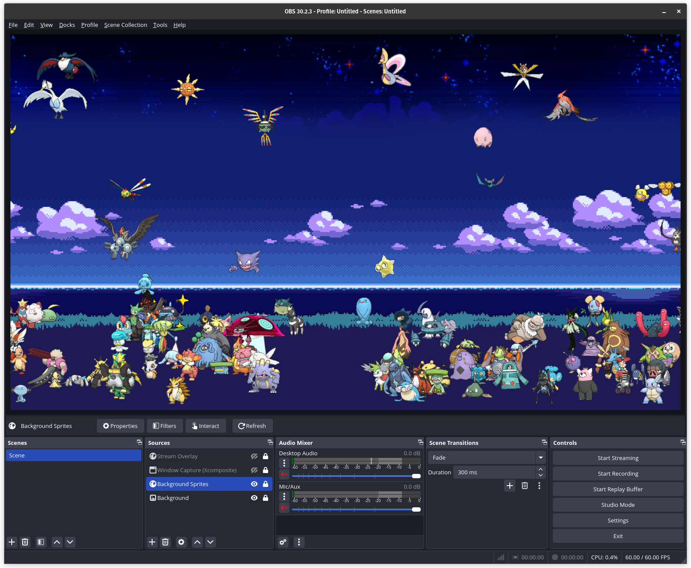
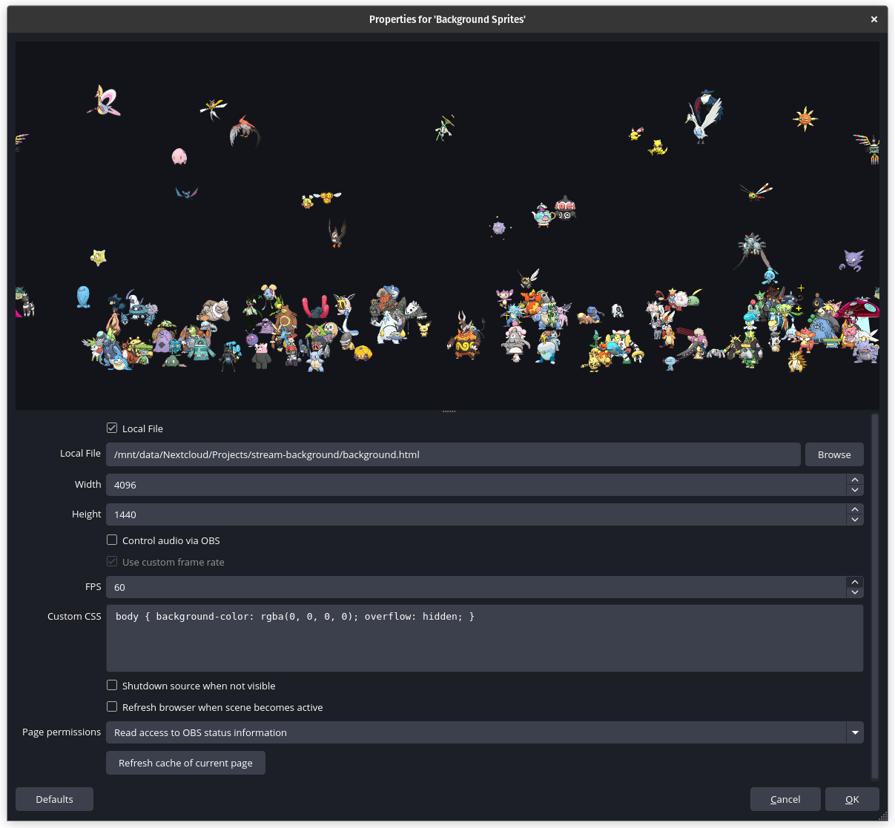
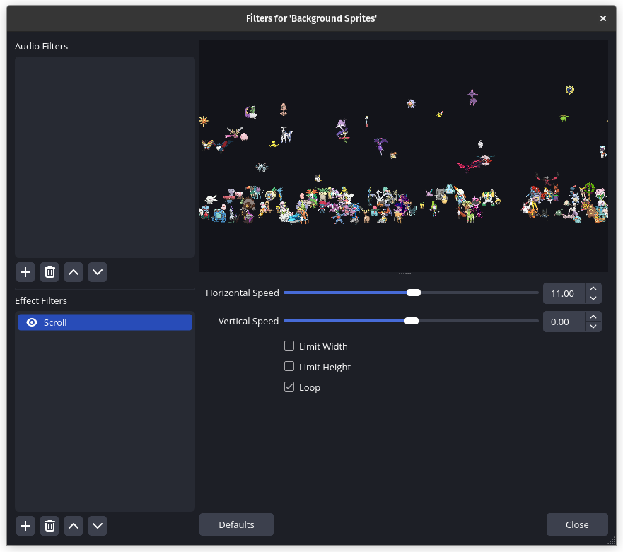

#  Stream Background

This is the background behind the [🔴24/7 ✨Shiny✨ Hunting Bot Stream](https://www.youtube.com/watch?v=W6OOnrx8g58).

Wallpaper Engine version by Nurufu: https://steamcommunity.com/sharedfiles/filedetails/?id=3334138890

Full credit for all sprites included: [Pokémon Showdown](https://pokemonshowdown.com/). ❤️
- Normal 3D sprites: https://play.pokemonshowdown.com/sprites/ani/?C=M;O=D
- Shiny 3D sprites: https://play.pokemonshowdown.com/sprites/ani-shiny/?C=M;O=D

Sprites have been re-uploaded to the repo, and are referenced locally to avoid smashing Showdown's servers if someone decides to set hundreds of background sprites.

## Notes
- Controllable parameters such as shiny odds, max onscreen Pokémon, reload rate etc. are at the top of [background.js](scripts/background.js).
- Designed to place floating Pokémon in the top ~3/5 of the screen, and all others at the bottom.
- Floating Pokémon are defined in [background_pokemon.js](scripts/background_pokemon.js).
- (TODO: fix) Contains many hard coded values that are designed to work specifically for `2560*1440` stream resolutions.

## Sample OBS Config

- Add Image source: `background.png`.
- Add Browser source (local file): `background.html`.
    - Width: `4096`.
    - Height: `1440`.
    - Custom CSS: `body { background-color: rgba(0, 0, 0, 0); overflow: hidden; }`
- Add `Scroll` effect filters to the image and browser sources.
    - Horizontal Speed: `11`.
    - Loop: `Enable`.

test
